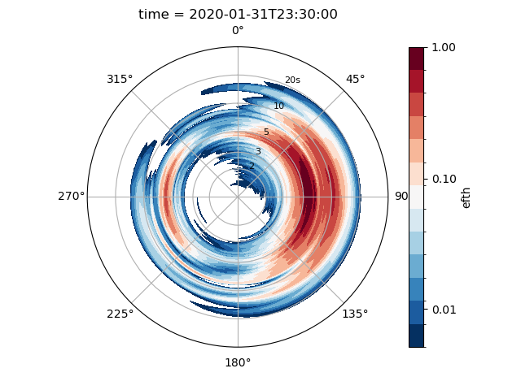

# waveTools

A Python toolbox for processing wave data.
{:height="300px" width="300px"}

## Objective

The objective of the waveTools module is to provide a set of tools for processing both raw datawell wave data.

## Installation

You can install waveTools directly from GitHub using pip. Here's how:

1. Open your terminal.

2. Run the following command:

```bash
pip install git+https://github.com/yourusername/waveTools.git

### Example

A simple example from datawell displacement data.

The toolbox is designed to work with data in 30 minute segments and either Mk4 displacement data (2.56hz) or Mk3 displacement data (1.28hz).

The following data format is assumed when parsing data into the module.

| Time |Heave |North |West |
| ---- |----- | ----- |---- |
| float | float | float | float |

"""
import readDatawell, waveStats

df = readDatawell.readDisplacement('./example_data/brisbane_4183{disp}2020-02-01.csv')

df = df['2020-02-01 00:01':'2020-02-01 00:30']
df.head()

data = waveStats.displacements(df)

data.wave_stats().T


"""
| hsig|hmax|tz|tp|hm0|hrms|t02|pkDir|aveDir|
| ----|-----|-----|----|---|-----|----|------|------|
| 0.792|2.267|4.816|5.556|1.039|0.56|4.665|83.794|114.912|

